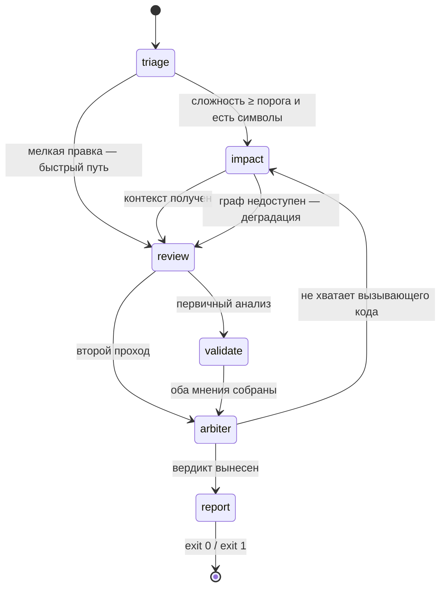

# ДЗ №16: логика выполнения агента

Управляемый сценарий из шести состояний с ветвлениями, возвратом назад, инструментами
и передачей задачи в соседнюю мультиагентную систему.

Собран на двух проектах:

| Проект | Роль в сценарии |
|---|---|
| **LLMAgent** (этот) | ревьюер изменений перед `git push` — оркестратор сценария |
| **[LLmSeracher](../LLmSeracher)** | сеть агентов с графом кода в Neo4j — владелец знаний о вызывающем коде |

## 1. Задача и её шаги

Проверить изменения перед пушем и решить, пускать ли их в репозиторий.

| # | Состояние | Что делает |
|---|---|---|
| 1 | `triage` | оценивает сложность изменений 1–10, выделяет затронутые типы и методы |
| 2 | `impact` | ставит задачу агенту `retriever` чужой сети и получает из графа кода вызывающий код |
| 3 | `review` | анализирует дифф в цикле ReAct, имея на руках контекст влияния |
| 4 | `validate` | независимо проверяет тот же дифф другой моделью |
| 5 | `arbiter` | сводит два мнения: подтверждает или снимает спорные находки |
| 6 | `report` | печатает маршрут и находки, гейт пуша (`exit 0` / `exit 1`) |

## 2. Последовательность и схема

Маршрут не зашит в вызывающем коде: каждое состояние возвращает `AgentTransition` —
имя следующего узла и причину перехода. `Agent.Run` задаёт только точку входа.



Код: [`Modules/Agent/AgentEngine.cs`](LLMAgent/Modules/Agent/AgentEngine.cs) —
машина состояний, [`Modules/Agent/States`](LLMAgent/Modules/Agent/States) — узлы.

## 3. Ветвления и проверки

| Где | Условие | Куда ведёт |
|---|---|---|
| `triage` | сложность ниже порога `Impact:ComplexityThreshold` или символов не нашлось | сразу `review`, без обращения к графу |
| `impact` | граф не ответил | `review` + `Info`-находка: анализ по одному диффу |
| `review` | это второй проход | сразу `arbiter`, минуя валидацию: дифф не менялся |
| `arbiter` | критических находок нет | `report` — консенсус, разбирательства не требуется |
| `arbiter` | модели не хватает вызывающего кода | **возврат** в `impact` с уточнённым запросом |
| `report` | остались критические находки | вопрос пользователю, `exit 1` при отказе |

Возврат ограничен: `Impact:MaxArbiterRetries` (по умолчанию 1) и предохранитель
`MaxTransitions = 12` в движке.

## 4. Инструменты и память

**Инструменты ReAct** ([`RepoToolFactory`](LLMAgent/Modules/Tools/RepoToolFactory.cs)):
`read_file`, `git_log`, `search_files` и новый `graph_impact` — он уходит не в файловую
систему, а в чужую сеть агентов.

**Внешняя память** — граф кода в Neo4j (852 узла, 2332 ребра на этом решении). Ревьюер
не читает его сам: ставит задачу `context.search` агенту-владельцу и предъявляет подписанный
токен с полномочием `context:read` — тот же механизм ACP/AP2-lite, что и внутри LLmSeracher.

```
reviewer ──POST /a2a/agents/retriever/tasks (SSE)──> retriever ──> граф кода (Neo4j)
         <── ContextAttachedEvent: кто вызывает изменённый символ ──
```

Ответ приходит с обоснованием подключения каждого фрагмента — путём в графе
(`вызывает PromptBuilder.RenderContextBlock`), а не просто «похожим кодом».

## 5. Как воспроизвести

```bash
# 1. инфраструктура графа (каталог LLmSeracher)
docker compose up -d
dotnet run --project LLmSeracher.Indexer -- index --reset
dotnet run --project LLmSeracher.AgentHost

# 2. сценарий (каталог LLMAgent)
dotnet run --project LLMAgent/LLMAgent.csproj -- "C:\path\to\repo"
```

Без хоста агентов сценарий тоже выполняется — уходит в ветку деградации.

Прошлое ДЗ проекта LLmSeracher работает как раньше: `dotnet run --project LLmSeracher -- --demo`.
Со стороны той сети ничего менять не потребовалось — ревьюер использует существующий навык
`context.search` как обычный внешний потребитель.

## Прогон

Проверяемый коммит — двухстрочное изменение сигнатуры `PromptBuilder.RenderContextBlock`
в клоне репозитория LLmSeracher: добавлен обязательный параметр, вызывающий код не поправлен.

```
Триаж: сложность 3/10, затронутые символы: PromptBuilder, RenderContextBlock
Переход: triage → review (сложность 3 < порога 4 — быстрый путь без графа)
Когнитивный роутинг: сложность 3 → модель openai/gpt-oss-20b (CostEfficiency 3)
   🕸 спрашивает граф кода: кто вызывает PromptBuilder.RenderContextBlock
Делегирование: retriever ← context.search [context:read]
Этап анализа: находок 2, контекст влияния 12 фрагм.
Переход: review → validate (первичный анализ завершён)
Этап валидации: находок 1.
Переход: validate → arbiter (оба мнения собраны)
Арбитраж: подтверждено 3, снято 0 из 3.

════════════════ РЕЗУЛЬТАТ ПРОВЕРКИ КОММИТА ════════════════
Сложность изменений: 3/10
Контекст влияния: 12 фрагм. из графа кода (по запросу модели)

Маршрут по графу состояний:
  triage → review: сложность 3 < порога 4 — быстрый путь без графа
  review → validate: первичный анализ завершён
  validate → arbiter: оба мнения собраны
  arbiter → report: вердикт вынесен: подтверждено 3, снято 0

⛔ [Анализ] SummarizerAgent.cs: RenderContextBlock signature changed to include
   startNumber parameter, but existing callers still invoke it with one argument
⛔ [Валидация] PromptBuilder.cs: добавлен аргумент startNumber, нарушает контракт API
⛔ Найдено критических ошибок: 3. Пуш приостановлен.
```

Интересное в этом прогоне: триаж оценил правку как мелкую и увёл сценарий мимо состояния
`impact` — а модель на этапе анализа всё равно сходила в граф сама, инструментом. Ровно
поэтому вызывающий код нашёлся, хотя обязательного шага не было.

Ветки, проверенные отдельными прогонами:

| Ветка | Как воспроизведена |
|---|---|
| `triage → impact` | сложность 5 при пороге 4 — 12 фрагментов из графа, первыми двумя реальные вызывающие |
| `triage → review` | сложность 3 — прогон выше |
| `impact → review` (деградация) | остановленный `AgentHost`: `Info`-находка «граф не ответил», анализ по диффу |
| `arbiter → report` с вердиктом | «подтверждено 1, снято 1»: снятая находка понижена до `Info` с обоснованием арбитра |
| `arbiter → report` fail-closed | модель роли `Orchestration` не осилила структурный вывод — критические находки остались в силе |
| `report` → `exit 1` | все прогоны с критическими находками |

Возврат `arbiter → impact` в живом прогоне не сработал: модели ни разу не поставили
`needsContext=true`. Ветка реализована и ограничена `MaxArbiterRetries`, но на этих моделях
её видно только в коде.

## Соответствие критериям

| Критерий | Где |
|---|---|
| Реализована последовательность шагов | 6 состояний, маршрут печатается в отчёте прогона |
| Есть управление логикой (ветвление/проверка) | 6 точек ветвления, включая возврат назад и предохранитель от зацикливания |
| Сценарий выполняется корректно | прогон выше: обе ветки `impact` (успех и деградация), вердикт арбитра, fail-closed при отказе моделей |
| Логика через граф состояний | `IAgentState` + `AgentTransition`; переход выбирает состояние, а не вызывающий код |
| Пайплайн агентных процессов | межпроцессный handoff по A2A с проверкой полномочий на приёмной стороне |
