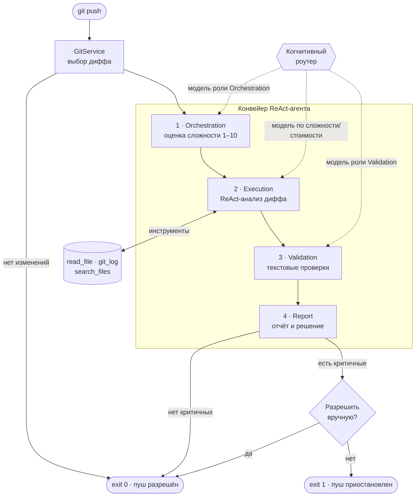

# LLMAgent

CLI-агент, который **проверяет изменения перед `git push`**: берёт дифф, анализирует его
несколькими LLM и решает — разрешить пуш (`exit 0`) или приостановить (`exit 1`).
Рассчитан на использование как `pre-push` git-hook.

В основе две идеи:

- **ReAct** — на этапе анализа модель сама вызывает инструменты (`read_file`, `git_log`,
  `search_files`), чтобы дочитать контекст за пределами диффа, прежде чем сделать вывод.
- **Когнитивный роутер** — из заданных в конфиге моделей выбирает подходящую под конкретный
  шаг: по роли (Orchestration / Execution / Validation) и, для анализа, по соотношению
  «сложность изменений ↔ стоимость/ум модели».

## Схема агента



## Как это работает

| Шаг | Что делает | Результат |
|-----|------------|-----------|
| **1. Orchestration** | Оценивает когнитивную сложность изменений по шкале 1–10. | Балл сложности |
| **2. Execution** | Главный анализ. Модель в цикле ReAct читает файлы и историю, ищет баги, уязвимости, нарушения контрактов. | Список находок |
| **3. Validation** | Лёгкие проверки по тексту диффа: типы, сигнатуры, опечатки, забытые `await`/`return`. | Список находок |
| **4. Report** | Печатает сводку. Если есть критические находки — приостанавливает пуш до явного решения пользователя. | Код выхода 0/1 |

Дифф выбирается автоматически: сначала незапушенные коммиты (`@{u}..HEAD`), иначе последний
коммит (`HEAD~1..HEAD`), иначе изменения рабочего дерева. Если изменений нет — пуш сразу разрешён.

**Fail-closed:** если модель недоступна или вернула неразборчивый ответ, шаг добавляет
критическую находку и блокирует пуш — а не «тихо» его разрешает.

## Когнитивный роутер

Каждой модели в конфиге назначается роль и параметры:

- **Orchestration / Validation** — берётся модель роли с наибольшим `Priority`.
- **Execution** — роутер выбирает самую дешёвую модель, чьё `CostEfficiency` не ниже оценённой
  сложности; если такой нет — самую «умную». Так простые правки уходят на дешёвые модели,
  а сложные — на мощные.

## Запуск

Требуется **.NET 10 SDK** и установленный `git` в `PATH`.

```bash
# Сборка
dotnet build

# Проверить конкретный репозиторий
dotnet run --project LLMAgent/LLMAgent.csproj -- "C:\path\to\repo"

# Без аргумента берётся текущий каталог
dotnet run --project LLMAgent/LLMAgent.csproj
```

Коды выхода: `0` — пуш разрешён, `1` — пуш приостановлен (или ошибка).

### Как pre-push hook

```bash
# .git/hooks/pre-push
#!/bin/sh
exec dotnet run --project /path/to/LLMAgent/LLMAgent.csproj -- "$(git rev-parse --show-toplevel)"
```

Ненулевой код выхода прервёт `git push`.

## Конфигурация

Модели и провайдеры задаются в `LLMAgent/appsettings.json`, секция `Apis` (работает с любым
OpenAI-совместимым endpoint — OpenRouter, LM Studio, корпоративные шлюзы):

```jsonc
{
  "Apis": [{
    "Name": "OpenRouter",
    "ApiKey": "",                      // лучше задавать через переменную окружения
    "Endpoint": "https://openrouter.ai/api/v1",
    "Models": [
      { "Name": "openai/gpt-oss-120b:free",   "Role": "Orchestration", "Priority": 1, "CostEfficiency": 4 },
      { "Name": "nvidia/nemotron-...:free",    "Role": "Execution",     "Priority": 1, "CostEfficiency": 8 }
    ]
  }]
}
```

- **Роли:** `Orchestration`, `Execution`, `Validation`.
- **Ключи через окружение:** `Apis__0__ApiKey`, `Apis__1__Endpoint`, … перекрывают JSON.
  **Не коммитьте реальные ключи** в `appsettings.json`.

## Технологии

.NET 10 · [Microsoft.Extensions.AI](https://learn.microsoft.com/dotnet/ai/) (function-calling и
structured output) · Microsoft.Extensions.{DependencyInjection, Configuration, Logging}.
Работа с `git` — через системный процесс, без сторонних зависимостей.

## Разработчикам

Архитектура, соглашения, команды и инструкции по расширению — в [AGENTS.md](AGENTS.md).
