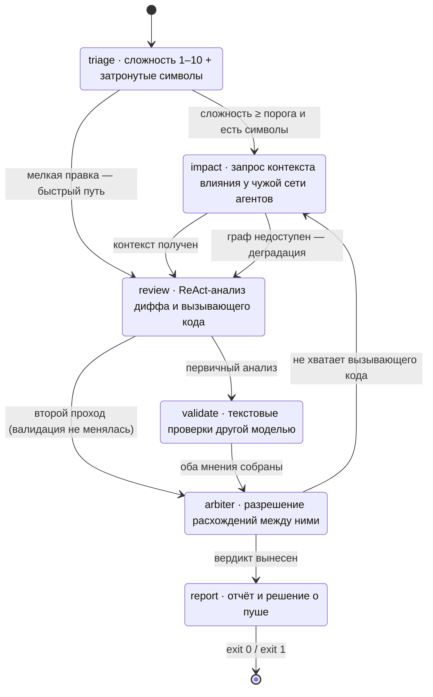

# LLMAgent

CLI-агент, который **проверяет изменения перед `git push`**: берёт дифф, анализирует его
несколькими LLM и решает — разрешить пуш (`exit 0`) или приостановить (`exit 1`).
Рассчитан на использование как `pre-push` git-hook.

В основе три идеи:

- **Граф состояний** — сценарий проверки не цепочка шагов, а граф: состояние само решает,
  куда передать управление. Отсюда быстрый путь для мелких правок, обращение к чужой сети
  агентов для крупных и возврат на второй проход по требованию арбитра.
- **ReAct** — на этапе анализа модель сама вызывает инструменты (`read_file`, `git_log`,
  `search_files`, `graph_impact`), чтобы дочитать контекст за пределами диффа.
- **Когнитивный роутер** — из заданных в конфиге моделей выбирает подходящую под конкретный
  шаг: по роли (Orchestration / Execution / Validation) и, для анализа, по соотношению
  «сложность изменений ↔ стоимость/ум модели».

## Схема агента


```mermaid
stateDiagram-v2
    direction TB
    [*] --> triage

    triage: triage · сложность 1–10 + затронутые символы
    impact: impact · запрос контекста влияния у чужой сети агентов
    review: review · ReAct-анализ диффа и вызывающего кода
    validate: validate · текстовые проверки другой моделью
    arbiter: arbiter · разрешение расхождений между ними
    report: report · отчёт и решение о пуше

    triage --> impact: сложность ≥ порога и есть символы
    triage --> review: мелкая правка — быстрый путь
    impact --> review: контекст получен
    impact --> review: граф недоступен — деградация
    review --> validate: первичный анализ
    review --> arbiter: второй проход (валидация не менялась)
    validate --> arbiter: оба мнения собраны
    arbiter --> impact: не хватает вызывающего кода
    arbiter --> report: вердикт вынесен
    report --> [*]: exit 0 / exit 1
```

## Как это работает

| Состояние | Что делает | Результат |
|-----------|------------|-----------|
| **triage** | Оценивает когнитивную сложность 1–10 и выделяет затронутые типы и методы. | Балл, список символов, выбор ветки |
| **impact** | Ставит задачу агенту `retriever` сети [LLmSeracher](../LLmSeracher) и получает из графа кода вызывающий код изменённых символов. | Фрагменты контекста влияния |
| **review** | Главный анализ. Модель в цикле ReAct читает файлы, историю и граф, ищет баги, уязвимости, нарушения контрактов. | Список находок |
| **validate** | Лёгкие проверки по тексту диффа: типы, сигнатуры, опечатки, забытые `await`/`return`. | Список находок |
| **arbiter** | Сверяет два независимых мнения: подтверждает спорные находки, снимает домыслы, при нехватке фактов отправляет сценарий на второй проход. | Вердикт по каждой критической находке |
| **report** | Печатает маршрут по графу и сводку. Критические находки приостанавливают пуш до явного решения пользователя. | Код выхода 0/1 |

Дифф выбирается автоматически: сначала незапушенные коммиты (`@{u}..HEAD`), иначе последний
коммит (`HEAD~1..HEAD`), иначе изменения рабочего дерева. Если изменений нет — пуш сразу разрешён.

**Fail-closed:** если модель недоступна или вернула неразборчивый ответ, шаг добавляет
критическую находку и блокирует пуш — а не «тихо» его разрешает. Отказ арбитра означает,
что критические находки остаются в силе; отказ графа кода — деградацию до анализа по диффу.

## Кто принимает решение

Три способа свести мнения нескольких агентов различаются, и в сценарии участвуют все три:

- **консенсус** — `review` и `validate` работают независимо и не видят находок друг друга;
  совпавшая находка подтверждается арбитром без разбирательства;
- **арбитраж** — расхождения разрешает отдельная роль, а не правило «любая критическая
  находка блокирует»: иначе решение принимает тот из агентов, кто мнительнее;
- **диктатор** — последнее слово у человека: `report` не пропускает пуш с критическими
  находками без явного подтверждения, каким бы ни был вердикт арбитра.

## Контекст влияния из графа кода

Ревьюер не ищет вызывающий код сам: он ставит задачу `context.search` агенту `retriever`
проекта [LLmSeracher](../LLmSeracher) — владельцу графа кода — и предъявляет подписанный
токен с полномочием `context:read`. Транспорт, формат задачи и подпись переиспользуются
из `LLmSeracher.Core`, поэтому протокол один на обе системы.

```
reviewer ──POST /a2a/agents/retriever/tasks (SSE)──> retriever ──> граф кода (Neo4j)
         <── ContextAttachedEvent: кто вызывает изменённый символ ──
```

Что нужно для работы этой ветки:

```bash
# в каталоге LLmSeracher
docker compose up -d                                        # Neo4j
dotnet run --project LLmSeracher.Indexer -- index --reset    # наполнить граф
dotnet run --project LLmSeracher.AgentHost                   # хост агентов на :5080
```

Без хоста агентов сценарий работает: `impact` логирует отказ, добавляет `Info`-находку
и уходит в `review` — анализ идёт по одному диффу. Настройки — секция `Impact`
в `appsettings.json`; `A2A:SigningSecret` обязан совпадать с секретом сети агентов.

## Когнитивный роутер

Каждой модели в конфиге назначается роль и параметры:

- **Orchestration / Validation** — берётся модель роли с наибольшим `Priority`.
- **Execution** — роутер выбирает самую дешёвую модель, чьё `CostEfficiency` не ниже оценённой
  сложности; если такой нет — самую «умную». Так простые правки уходят на дешёвые модели,
  а сложные — на мощные.

## Запуск

Требуется **.NET 10 SDK** и установленный `git` в `PATH`.

```bash
# Сборка
dotnet build

# Проверить конкретный репозиторий
dotnet run --project LLMAgent/LLMAgent.csproj -- "C:\path\to\repo"

# Без аргумента берётся текущий каталог
dotnet run --project LLMAgent/LLMAgent.csproj
```

Коды выхода: `0` — пуш разрешён, `1` — пуш приостановлен (или ошибка).

### Как pre-push hook

```bash
# .git/hooks/pre-push
#!/bin/sh
exec dotnet run --project /path/to/LLMAgent/LLMAgent.csproj -- "$(git rev-parse --show-toplevel)"
```

Ненулевой код выхода прервёт `git push`.

## Конфигурация

Модели и провайдеры задаются в `LLMAgent/appsettings.json`, секция `Apis` (работает с любым
OpenAI-совместимым endpoint — OpenRouter, LM Studio, корпоративные шлюзы):

```jsonc
{
  "Apis": [{
    "Name": "OpenRouter",
    "ApiKey": "",                      // лучше задавать через переменную окружения
    "Endpoint": "https://openrouter.ai/api/v1",
    "Models": [
      { "Name": "openai/gpt-oss-120b:free",   "Role": "Orchestration", "Priority": 1, "CostEfficiency": 4 },
      { "Name": "nvidia/nemotron-...:free",    "Role": "Execution",     "Priority": 1, "CostEfficiency": 8 }
    ]
  }]
}
```

- **Роли:** `Orchestration`, `Execution`, `Validation`.
- **Ключи через окружение:** `Apis__0__ApiKey`, `Apis__1__Endpoint`, … перекрывают JSON.
  **Не коммитьте реальные ключи** в `appsettings.json`.

## Технологии

.NET 10 · [Microsoft.Extensions.AI](https://learn.microsoft.com/dotnet/ai/) (function-calling и
structured output) · Microsoft.Extensions.{DependencyInjection, Configuration, Logging}.
Работа с `git` — через системный процесс, без сторонних зависимостей.

## Разработчикам

Архитектура, соглашения, команды и инструкции по расширению — в [AGENTS.md](AGENTS.md).
