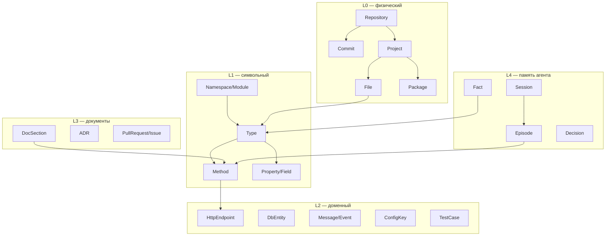
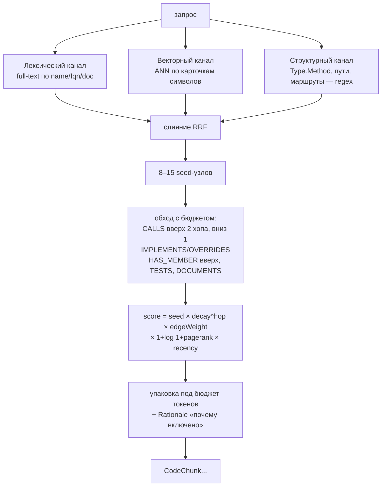

# Граф кода: выбор базы, модель, наполнение, поиск

Разбор того, на чём стоит контекст влияния — единственная функция агента, которой нет
у линтера: отвечать на вопросы о коде, которого нет в диффе. Основной язык индексируемых
проектов — C#, в планах TS/JS и Python.

Документ отвечает на три вопроса: **какая БД**, **как наполнять и поддерживать актуальность**,
**как по ней искать**.

> Написан до объединения двух проектов, когда граф подключался к сети агентов как ещё один
> источник контекста, и сохранён почти целиком: выбор БД, модель графа, извлечение связей
> и устройство поиска от переезда не изменились. Убраны разделы про миграцию той кодовой
> базы — работа выполнена, её описание устарело. Раздел 8 переписан под текущее состояние.
>
> Полная исходная версия — в истории репозитория
> [llm-grapth-searcher-hw](https://github.com/IgorViskov/llm-grapth-searcher-hw).

---

## 1. Выбор графовой БД

### Критерии, специфичные для этой задачи

1. **.NET-драйвер первого класса** — приложение на .NET 10, сайдкары на других рантаймах нежелательны.
2. **Cypher** — обходы переменной глубины (`*1..3`), фильтры по типам рёбер, пути между узлами.
   На SQL с рекурсивными CTE то же самое пишется в 5–10 раз длиннее и требует ручной борьбы с циклами.
3. **Вектор + полнотекстовый индекс внутри той же БД.** Вход в граф гибридный; отдельный
   векторный стор означает второй источник истины и постоянную рассинхронизацию с графом.
4. **Дешёвые точечные апдейты** — переиндексация идёт покоммитно, десятки раз в день.
5. **Масштаб.** Репозиторий на 5 000 файлов C# → ~150 тыс. узлов, ~1.5 млн рёбер.
   Монорепа → до 10 млн рёбер. Это **мало** для любого кандидата; масштаб не является
   разделяющим критерием, и оптимизировать под него не нужно.
6. Локальный запуск без тяжёлой инфраструктуры: агент ставится на машину разработчика.

### Кандидаты

| БД | .NET-клиент | Язык запросов | Вектор + FTS внутри | Развёртывание | Лицензия | Вердикт |
|---|---|---|---|---|---|---|
| **Neo4j** | `Neo4j.Driver` **6.3.0** (июль 2026), первая сторона, net8+/net10, 4.9 млн загрузок | Cypher (GQL-совместимый) | Да: vector index (HNSW) + full-text (Lucene) | Docker, ~2 ГБ RAM | GPLv3 (CE) / коммерческая (EE) | **Основной выбор** |
| **Memgraph** | тот же `Neo4j.Driver` — Bolt-совместим | openCypher | Да | Docker, in-memory (RAM ≈ размер графа) | BSL 1.1 → Apache 2.0 | Запасной: если упрёмся в latency обходов |
| **FalkorDB** | `NFalkorDB` — официальный, поверх `StackExchange.Redis` | openCypher | Да | Docker, Redis-модуль, самый лёгкий | собственная | Запасной: минимум инфраструктуры |
| **Kùzu / LadybugDB** | **нет биндинга** (только P/Invoke к C API) | Cypher | Да | embedded, ноль инфраструктуры | MIT | **Не брать сейчас** — см. ниже |
| **PostgreSQL + Apache AGE + pgvector** | `Npgsql` | Cypher внутри SQL | pgvector + tsvector | один Postgres | Apache 2.0 | Разумно, если Postgres уже в стеке |
| ArangoDB / Neptune / Cosmos Gremlin | community / cloud SDK | AQL / Gremlin | частично | — | BSL / cloud | Преимуществ для задачи не дают |

### Почему не Kùzu, хотя embedded здесь очень соблазнителен

Встраиваемая графовая БД сняла бы с разработчика второй контейнер — это ровно то, чего
хочется, тем более что образ агента и без того тяжёлый. Но:

- оригинальный репозиторий **заархивирован 10 октября 2025** после покупки Kùzu Inc. компанией Apple;
- сообщество разошлось на несколько форков — LadybugDB, bighorn (Kineviz), Vela-Engineering/kuzu;
  ни один пока не набрал репутации «безопасного выбора»;
- **.NET-биндинга нет ни у одного форка** (Python, Node, Rust, Go, Swift, Java, C/C++) —
  пришлось бы писать и сопровождать P/Invoke-обёртку над C API.

Возвращаться к этому варианту стоит, когда у LadybugDB появится стабильный .NET-биндинг:
для однопользовательского инструмента разработчика embedded-модель объективно лучше.

### Рекомендация

**Neo4j** как основная БД, за интерфейсом `IGraphStore`. Cypher у Neo4j, Memgraph и FalkorDB
совместим почти дословно, а Memgraph говорит по тому же Bolt-протоколу — переезд на любой
из запасных вариантов стоит замены строки подключения и нескольких запросов, а не переписывания.

Postgres + AGE — единственная реальная альтернатива по существу, а не по вкусу: если у вас
уже эксплуатируется Postgres, вариант «один сервер, pgvector и граф в одном месте, Apache 2.0»
весит много. Расплата — эргономика Cypher-внутри-SQL и заметно более слабые глубокие обходы.

**Чего графовая БД не заменяет.** Вектора остаются нужны для входа в граф по описательному
запросу. Граф отвечает на «кто это вызывает», «что сломается», «где реализация интерфейса» —
на такие вопросы векторный поиск не отвечает в принципе, ни при каком качестве эмбеддингов.
Ценность в связке, а не в замене одного другим.

---

## 2. Модель графа

### Слои



Слои L0–L1 извлекаются детерминированно из компилятора, L2 — эвристиками по атрибутам и
маршрутам, L3 — из markdown и VCS, L4 — из работы самого агента. Разделение важно: у слоёв
разная точность и разная частота обновления, и смешивать их в ранжировании нельзя.

### Рёбра

**Структурные** (точность ~100 %, дёшево):
`(:Project)-[:CONTAINS]->(:File)`, `(:File)-[:DECLARES]->(:Type|:Method)`,
`(:Type)-[:HAS_MEMBER]->(:Method|:Property|:Field)`, `(:Project)-[:REFERENCES]->(:Project|:Package)`

**Типовые:**
`(:Type)-[:INHERITS]->(:Type)`, `[:IMPLEMENTS]`, `(:Method)-[:OVERRIDES]->(:Method)`,
`[:IMPLEMENTS_MEMBER]`, `(:Method)-[:RETURNS]->(:Type)`, `[:HAS_PARAM {pos,name}]->(:Type)`

**Потоковые — основная ценность:**
`(:Method)-[:CALLS {file,line,viaInterface}]->(:Method)`, `[:READS|WRITES]->(:Field|:Property)`,
`[:INSTANTIATES]->(:Type)`, `[:THROWS]->(:Type)`

**DI-специфика C# — критично, легко упустить:**

```
(:Type)-[:REGISTERED_AS {lifetime:"singleton"}]->(:Type)   ← из AddSingleton<TService,TImpl>()
```

Без этих рёбер граф вызовов рвётся на каждом интерфейсе. Ваш собственный код — точная
иллюстрация: `PriceCalculator` вызывает `IDiscountPolicy.RateFor`, а исполняются
`TierDiscountPolicy` и `VolumeDiscountPolicy`. Чисто синтаксически связь
`PriceCalculator → TierDiscountPolicy` не выводится ни при каком анализе вызовов — она
существует только в строке `AddSingleton<IDiscountPolicy, TierDiscountPolicy>()`.
Экстрактор регистраций DI обязателен, а при обходе `CALLS` в интерфейсный метод нужно
дополнительно раскрывать `IMPLEMENTS_MEMBER` в обратную сторону.

**Исторические (из git):**
`(:Commit)-[:TOUCHES]->(:File)`, `(:Commit)-[:AUTHORED_BY]->(:Person)`,
производное `(:File)-[:CO_CHANGED {count,lastAt}]-(:File)`.
Со-изменяемость даёт связи, которых нет в AST: `appsettings.json` ↔ `ContextOptions.cs`,
клиент ↔ сервер, код ↔ его миграция. Дёшево считается и заметно улучшает выдачу.

**Документные:** `(:DocSection)-[:DOCUMENTS]->(:Type|:Method)` — по `<see cref>` в XML-doc
и по упоминанию идентификаторов в markdown.

### Узел-символ

```
id            "shop-demo|csharp::M:ShopDemo.Domain.Pricing.PriceCalculator.CalculateTotal(ShopDemo.Domain.Order)"
              ← префикс до «|» — ключ репозитория: одна база обслуживает несколько
kind          Method | Type | Property | Field | External
name / fqn    "CalculateTotal" / "ShopDemo.Domain.Pricing.PriceCalculator.CalculateTotal"
signature     "public decimal CalculateTotal(Order order)"
language      "csharp"
repo          "shop-demo"
filePath      "src/ShopDemo.Domain/Pricing/PriceCalculator.cs"
startLine / endLine   56 / 57
docComment    XML-doc символа
bodyHash      sha256 тела  ← инкрементальность и решение «пересчитывать ли эмбеддинг»
summary       LLM-саммари, лениво
embedding     float[1536]
sourceFile    файл, при разборе которого узел порождён  ← ключ инкрементального удаления
visibility, isStatic, isAbstract, isTest, confidence
commitSha, updatedAt
```

Индексы, без которых работать не будет:
уникальный constraint на `(:Symbol {id})` (иначе `MERGE` деградирует в полный скан),
full-text по `name, fqn, docComment, summary`, vector по `embedding`, обычный по `sourceFile`.

**Правило против взрыва графа:** узел заводится только если на него можно осмысленно сослаться
в ответе. Локальные переменные, литералы, отдельные выражения в граф не идут никогда.

---

## 3. Извлечение сущностей и связей

### C# — Roslyn, альтернатив нет

`Microsoft.CodeAnalysis.CSharp.Workspaces` **5.6.0** (июль 2026, net8+/netstandard2.0, работает
на net10) + `Microsoft.Build.Locator` + `MSBuildWorkspace.OpenSolutionAsync`.
То, что индексатор — тоже .NET, здесь крупное преимущество: компилятор работает in-process,
без сайдкаров и промежуточных форматов.

Схема прохода: по каждому проекту — `Compilation`, по каждому документу — `SyntaxTree` и
`SemanticModel`; `CSharpSyntaxWalker` по дереву; на каждом `InvocationExpressionSyntax` —
`semanticModel.GetSymbolInfo(node).Symbol` → `IMethodSymbol` → ребро `CALLS`.

**Идентичность узла — `ISymbol.GetDocumentationCommentId()`.** Даёт строку вида
`M:Ns.Type.Method(System.String)`: стабильна между сборками, не зависит от форматирования,
переживает перемещение файла и переименование проекта. Это и есть ключ `MERGE`.
Оговорки: у локальных функций и лямбд идентификатора нет — синтезировать
`{родитель}+local:{имя}#{порядковый}` либо не индексировать; дженерики приходят
в нотации `` `1 `` и годятся как есть.

Что легко упустить:

- `symbol.ContainingAssembly` отделяет свой код от NuGet-символов. Внешние заводить как
  `:ExternalSymbol` с `package` — без тела, но с рёбрами. Это сразу даёт ответы вида
  «где мы используем `IChatClient.GetStreamingResponseAsync`».
- **Проверять `Compilation.GetDiagnostics()`.** Если проект не восстановлен (`dotnet restore`),
  `SemanticModel` молча деградирует и половина рёбер `CALLS` просто не появится, а индексатор
  отработает «успешно». Индексатор обязан падать или громко предупреждать на `CS0246`.
- `SymbolFinder.FindReferencesAsync` удобен, но дорог при полном обходе. На full index дешевле
  идти от вызова к определению одним проходом; `FindReferences` оставить интерактивным запросам.
- Экстрактор регистраций DI (`AddSingleton/AddScoped/AddTransient` с generic-аргументами) —
  отдельный проход, см. раздел 2.

### TypeScript / JavaScript

Два пути: свой Node-сайдкар на TS Compiler API / `ts-morph` либо **`scip-typescript`**
(индексатор Sourcegraph поверх тайпчекера TS) с разбором SCIP-protobuf в .NET через
`Google.Protobuf`. Рекомендую второй: чужая реализация, проверенная на масштабе, и тот же
парсер SCIP затем переиспользуется для Python — то есть одна интеграция вместо двух.

Особенность SCIP: он даёт `definitions` / `references` / `relationships`, но не даёт `CALLS`
напрямую. Рёбра вызова восстанавливаются стандартным приёмом — «ссылка, попадающая в диапазон
строк определения метода X, указывающая на определение метода Y» ⇒ `X CALLS Y`.

### Python

`scip-python` (на базе pyright), тот же конвейер. Но динамика языка ставит потолок точности:
надёжны `IMPORTS`, `DECLARES`, `INHERITS`; `CALLS` — с оговоркой, pyright не разрешает
`getattr`, monkey-patching и DI-контейнеры.

Дешёвый fallback для обоих второстепенных языков — tree-sitter: только `DECLARES` / `IMPORTS` /
`CALLS_BY_NAME` (по имени, без разрешения). Этого хватает на «где определена функция X».

**Механизм, который защищает основной язык:** свойство `confidence` на ребре
(C#/Roslyn — 1.0, scip-typescript — 0.9, scip-python — 0.7, tree-sitter — 0.4) и фильтр
`WHERE r.confidence >= 0.8` в точных запросах. Так неточность второстепенных языков не портит
выдачу по C#, и «пренебречь» ими можно не выкидыванием, а порогом.

### Кросс-языковые связи — то, ради чего стоит держать все три языка

```
(:TsFunction)-[:CALLS_HTTP]->(:HttpEndpoint)<-[:HANDLES]-(:CsMethod)
```

Маршрут берётся из `[HttpGet("/api/docs")]` либо из minimal API (`app.MapGet("/api/docs", …)`)
с одной стороны и из строковых литералов `fetch`/`axios` — с другой. Ни один языковой
индексатор такую связь не даёт, а на практике она самая востребованная: «кто на фронте
дёргает этот эндпоинт». Стоит отдельного небольшого экстрактора.

---

## 4. Наполнение и поддержание актуальности

```
git → Discover(изменённые файлы) → Extract → Normalize(Node/Edge DTO)
    → Upsert(граф) → Embed(асинхронно) → Derive(PageRank, CO_CHANGED)
```

### Владение рёбрами — основа инкрементальности

Каждый узел и каждое ребро несут `sourceFile` — файл, при разборе которого они порождены.
Тогда обновление файла `F` детерминированно и не требует диффа графа:

```cypher
// 1. снести всё, что порождено этим файлом
MATCH ()-[r {sourceFile: $f}]->() DELETE r;

// 2. записать заново
UNWIND $nodes AS n
  MERGE (s:Symbol {id: n.id}) SET s += n.props, s.sourceFile = $f;
UNWIND $edges AS e
  MATCH (a:Symbol {id: e.from}), (b:Symbol {id: e.to})
  MERGE (a)-[r:CALLS {sourceFile: $f}]->(b) SET r += e.props;

// 3. подчистить осиротевшие
MATCH (n:Symbol {sourceFile: $f}) WHERE NOT (n)--() DETACH DELETE n;
```

Тонкость, которую легко сделать неправильно: символ, объявленный в `F`, может быть **целью**
ребра из файла `G`. Поэтому удаляются только рёбра, **порождённые** `F`, а узлы — лишь
оставшиеся без связей.

### Радиус переиндексации

| Изменилось | Переразбирать |
|---|---|
| `.cs` | проект целиком (partial-классы, extension-методы, вывод типов); в граф писать дельту по `bodyHash` |
| `.csproj`, `Directory.Packages.props` | проект + все ссылающиеся на него |
| `.ts` | файл + его импортёры (модульность TS строже) |
| `.py` | файл + импортёры, с поправкой на низкую `confidence` |
| `*.md` | только документные рёбра |

Дороже всего C#: Roslyn всё равно строит `Compilation` на проект, поштучно файл не пересобрать.
На типичном проекте это единицы секунд — приемлемо.

### Триггеры

1. **CI на push в main — источник истины.** Джоб `index --since $BEFORE_SHA --to $AFTER_SHA`,
   по завершении обновляется `(:Repository {headSha})`.
2. **Локальный watcher** (`FileSystemWatcher` + debounce ~500 мс) для рабочей копии, пишет
   в отдельную ветку графа (`branch: "feature/x"`), чтобы не портить main.
3. **Ночная полная сверка** — обход с сравнением `bodyHash`, лечит дрейф от пропущенных
   вебхуков и упавших джоб. Количество расхождений за ночь — и есть метрика здоровья пайплайна,
   её стоит логировать с первого дня.

### Версионирование

Снапшот на коммит не делать — объём взрывается, а спрос почти нулевой. Граф хранит состояние
HEAD ветки; история живёт отдельным слоем `(:Commit)`. Вопросы «как было в релизе 1.2»
решаются разовым `git worktree` + временный граф, а не постоянным версионированием.

### Эмбеддинги

- Эмбеддится **карточка символа** — сигнатура + XML-doc + первые N строк тела + путь.
  Голое тело шумит и даёт худший recall, чем карточка.
- Пересчёт только при смене `bodyHash`.
- Очередь: индексатор ставит `embeddingStale: true`, фоновый воркер добирает батчами по 100
  через `IEmbeddingGenerator<string, Embedding<float>>` из `Microsoft.Extensions.AI` —
  пакет у вас уже подключён.
- Офлайн-режим: детерминированный хеш-эмбеддинг по образцу `FakeChatClient`, чтобы `--demo`
  и проверка деградирует до анализа по одному диффу, а не отказывает.

### Порядок стоимости

Репозиторий 5 000 файлов C#: полный проход Roslyn — минуты, ~150 тыс. узлов / ~1.5 млн рёбер,
1–2 ГБ в Neo4j вместе с векторами, эмбеддинги на `text-embedding-3-small` — единицы долларов
разово. Инкремент на коммит — секунды. Ни одна из цифр не является ограничением.

---

## 5. Как устроен поиск



Три канала входа нужны потому, что запросы бывают трёх разных природ: «где `CalculateTotal`»
(лексика), «как устроено начисление скидок» (вектора), «кто вызывает
`PriceCalculator.CalculateTotal`» (точное попадание в символ). Ревьюер задаёт запросы третьей
природы: имена символов ему даёт триаж, а не человек. Слияние — Reciprocal Rank
Fusion, а не взвешенная сумма: косинусная близость и BM25 несравнимы по шкале, складывать их
напрямую некорректно.

**Обратные `CALLS` важнее прямых.** Вопросы «что сломается, если поменять X» и «как этим
пользуются» — это callers, и векторный поиск их не находит никогда. Это и есть главный
практический выигрыш графа.

Пример — анализ влияния:

```cypher
MATCH (s:Symbol {id: $symbolId})
MATCH p = (s)<-[:CALLS|IMPLEMENTS_MEMBER*1..3]-(c:Symbol)
WHERE ALL(r IN relationships(p) WHERE r.confidence >= 0.8)
OPTIONAL MATCH (t:Symbol {isTest: true})-[:TESTS]->(c)
RETURN c.fqn, c.filePath, c.startLine, length(p) AS hops, collect(t.fqn) AS tests
ORDER BY hops, c.pagerank DESC LIMIT 40
```

**Агентный режим** (дороже, но качественнее): дать модели инструменты вместо одного
фиксированного запроса — `find_symbol`, `neighbors(symbolId, edgeTypes, depth)`,
`read_symbol`, `path_between(a,b)`, `impact(symbolId)` — и позволить самой решать, куда
расширяться. Это буквально ваша A2A-модель: отдельный агент с навыками и scope `graph:read`.
Разумный компромисс — одиночный запрос по умолчанию, агентный обход по флагу или при низкой
уверенности seed-узлов.

---

## 6. Долгосрочный контекст

Память живёт **в том же графе**, иначе её невозможно связать с кодом:

```
(:Session)-[:HAS]->(:Episode {query, answer, ts})
(:Episode)-[:MENTIONS]->(:Symbol)
(:Fact {statement, confidence, validFrom, validTo, observedAt})-[:ABOUT]->(:Symbol)
(:Decision {title, rationale})-[:AFFECTS]->(:Symbol)
(:Preference {scope:"user|project", statement})
```

**Битемпоральность** (подход Graphiti/Zep): у факта есть `validFrom`/`validTo` — когда он верен
в мире, и `observedAt` — когда мы о нём узнали. Новый противоречащий факт не удаляет старый,
а закрывает его `validTo`. Так сохраняется ответ на «почему мы так решили в марте» и не теряется
аудит.

**Инвалидация памяти кодом — главный аргумент за единый граф.** Если `Fact` привязан к
`Symbol`, а у символа сменился `bodyHash`, факт помечается `needsRevalidation: true`.
Иначе после первого же рефакторинга долговременная память начинает уверенно врать —
а это заметно хуже, чем её отсутствие.

Гигиена: дедупликация фактов по эмбеддингу (порог ~0.95), TTL на эпизоды, ночная консолидация
«несколько эпизодов → один факт».

---

## 7. Риски

| Риск | Как проявится | Что делать |
|---|---|---|
| **DI разрывает граф вызовов** | ответы не связывают интерфейс с реализацией | экстрактор `REGISTERED_AS` + раскрытие `IMPLEMENTS_MEMBER` при обходе — с первого этапа |
| **Непроведённый `restore`** | Roslyn молча теряет половину рёбер, индексатор «успешен» | проверка `GetDiagnostics()`, отказ индексировать при `CS0246` |
| **Дрейф графа** | тихая деградация качества, никто не замечает | ночная полная сверка + метрика расхождений в логах |
| **Соблазн индексировать всё** | взрыв рёбер, деградация обходов | правило: узел заводится, только если на него можно сослаться в ответе |
| **Память врёт после рефакторинга** | старые факты о переписанном коде | `needsRevalidation` по смене `bodyHash` |
| **Лицензия Neo4j CE (GPLv3)** | ограничения при поставке продукта заказчику | для внутреннего инструмента нормально; иначе Memgraph / FalkorDB / AGE |
| **Windows-окружение** | Neo4j и Memgraph — только через Docker Desktop | принять; embedded-вариант вернуть к рассмотрению, когда у LadybugDB появится .NET-биндинг |

---

## 8. Что реализовано

**Сделано.** Всё, что относится к самому графу, работает и проверено на демонстрационном
репозитории `samples/ShopDemo`.

| Компонент | Где |
|---|---|
| Neo4j 2026.06 отдельным контейнером | [docker-compose.yml](../docker-compose.yml) |
| Схема, constraints, полнотекстовый индекс, индексы по свойствам рёбер | [Neo4jGraphStore.cs](../src/ReviewAgent.CodeGraph/Neo4jGraphStore.cs) |
| Экстрактор C# на Roslyn: типы, методы, свойства, поля, точки входа top-level | [CSharpExtractor.cs](../src/ReviewAgent.CodeGraph/Indexing/CSharpExtractor.cs) |
| 13 типов рёбер, включая **REGISTERED_AS** из регистраций DI | [GraphKinds.cs](../src/ReviewAgent.CodeGraph/Model/GraphKinds.cs) |
| Инкрементальность через владение рёбрами (`sourceFile`) | [Neo4jGraphStore.DeleteBySourceFilesAsync](../src/ReviewAgent.CodeGraph/Neo4jGraphStore.cs) |
| Поиск: структурный и полнотекстовый каналы, слияние RRF, обход с затуханием, диверсификация по файлам | [GraphRetriever.cs](../src/ReviewAgent.CodeGraph/Retrieval/GraphRetriever.cs) |
| Определение намерения запроса (callers / implementations) | [QueryAnalyzer.cs](../src/ReviewAgent.CodeGraph/Retrieval/QueryAnalyzer.cs) |
| Контекст влияния как вызов метода, с потолком обращений за прогон | [ImpactSearch.cs](../src/ReviewAgent.CodeGraph/ImpactSearch.cs), [ImpactGateway.cs](../src/ReviewAgent.Core/Review/ImpactGateway.cs) |
| `Rationale` в промпте и цитирование `файл:строка` | [ImpactRenderer.cs](../src/ReviewAgent.Core/Review/ImpactRenderer.cs) |

**Что добавилось при переезде в агента** — три вещи, которых в исходном анализе не было:

1. **Разделение по репозиториям.** Один агент обслуживает несколько репозиториев, а Community
   Edition отдаёт единственную пользовательскую базу. Идентификаторы узлов получили префикс
   ключа репозитория, узлы и рёбра — свойство `repo`, все каналы поиска точек входа — фильтр
   по нему. Иначе запрос про `Basket` в одном репозитории вытаскивал бы одноимённый тип
   из другого.
2. **Триггеры актуальности — то, чего не хватало этапу 3 исходного плана.** Механика
   инкрементального обновления была готова, не было того, кто её вызывает. Теперь вызывает
   сам агент: полная индексация при подключении репозитория (в фоне, через очередь),
   инкрементальная — на каждом пуше, по списку файлов из диффа. Замер на `ShopDemo`:
   полная — 11 с, инкрементальная — 4 с.
3. **Явная проверка наличия SDK.** Риск «непроведённый restore» из раздела 7 имеет более
   грубого родственника: отсутствие .NET SDK в образе. Проявляется одинаково — Roslyn молча
   теряет рёбра, а индексация «успешна». Поэтому образ собран на SDK-базе,
   [`MSBuildBootstrapper`](../src/ReviewAgent.CodeGraph/Indexing/MSBuildBootstrapper.cs)
   регистрирует локатор первой строкой `Program.cs`, а найденный SDK печатается при старте
   и виден на странице настроек.

**Результат на демонстрационном репозитории:** 2 проекта, 10 файлов → 111 узлов, 212 рёбер.
Полная индексация ~11 с, повторный прогон идемпотентен. Запрос контекста влияния — единицы
сотен миллисекунд, на фоне десятков секунд работы модели незаметен.

**Не сделано:**

- **Векторный канал.** Точки входа ищутся только текстом. Практическое следствие: запрос,
  где понятие названо по-русски, а в коде по-английски, не находит нужный символ, и никакой
  настройкой Lucene это не закрывается. Для ревьюера разрыв мягче, чем для вопросов на
  естественном языке: запрос к графу строит не человек, а сам агент из имён символов,
  извлечённых триажем, — то есть попадание в идентификатор почти гарантировано. Слияние
  каналов написано так, что добавление третьего источника точек входа его не меняет.
- **Долгосрочная память** (битемпоральные факты, `MemoryAgent`) — не реализована вовсе.
  Агент помнит прогоны, но не помнит выводов о коде.
- **TS/JS и Python.** Схема графа и свойство `confidence` предусмотрены, экстракторов нет.
  Для .NET-репозиториев это не ограничение, для смешанных — да.
- **Ночная сверка графа с рабочим деревом.** Дрейф остаётся возможным, если файлы меняются
  вне пушей: правка без коммита в граф не попадает. Частично закрыто тем, что кнопка
  «Переиндексировать» есть в админке.

**Что показала проверка на живых моделях.** Дефекты, найденные при работе над исходным
проектом (разбор фабричных регистраций DI, ограничение числа фрагментов на файл, вес членов
типа против приватных хелперов), исправлены и перенесены. Проверка уже в составе агента дала
ещё два, и оба не про граф, а про его стык с моделью, — они разобраны в
[MODELS.md](MODELS.md#две-ошибки-найденные-проверкой): порог обращения к графу измерял
сложность анализа вместо риска для вызывающих, и цикл ReAct не имел потолка витков.


## Источники

- [Neo4j.Driver на NuGet](https://www.nuget.org/packages/Neo4j.Driver) — 6.3.0, 22.07.2026, net8+
- [Vector indexes — Cypher Manual](https://neo4j.com/docs/cypher-manual/current/indexes/semantic-indexes/vector-indexes/)
- [Memgraph](https://github.com/memgraph/memgraph) и [лицензия BSL 1.1](https://github.com/memgraph/memgraph/blob/master/licenses/BSL.txt)
- [FalkorDB](https://github.com/FalkorDB/FalkorDB), [NFalkorDB — официальный .NET-клиент](https://github.com/FalkorDB/NFalkorDB)
- [KuzuDB abandoned, community mulls options — The Register, 14.10.2025](https://www.theregister.com/2025/10/14/kuzudb_abandoned/)
- [From Kuzu to Ladybug — The Data Quarry](https://thedataquarry.com/blog/from-kuzu-to-ladybug/), [LadybugDB](https://ladybugdb.com/)
- [Apache AGE — roadmap и поддержка PG17/PG18](https://github.com/apache/age/discussions/2305)
- [Microsoft.CodeAnalysis.CSharp.Workspaces на NuGet](https://www.nuget.org/packages/Microsoft.CodeAnalysis.CSharp.Workspaces) — 5.6.0, 02.07.2026
- [Roslyn Integration and Symbol Extraction (docfx)](https://deepwiki.com/dotnet/docfx/7.2-roslyn-integration-and-symbol-extraction)
- [scip-dotnet](https://github.com/sourcegraph/scip-dotnet), [scip-typescript](https://github.com/sourcegraph/scip-typescript), [scip-python](https://github.com/sourcegraph/scip-python)
- [SCIP — формат индексов кода](https://sourcegraph.com/blog/announcing-scip)
- Прототипы того же класса: [stakgraph](https://github.com/stakwork/stakgraph) (tree-sitter + LSP + Neo4j), [code-graph-rag](https://github.com/vitali87/code-graph-rag) (Memgraph), [FalkorDB code-graph](https://www.falkordb.com/blog/code-graph-is-the-secret/)
